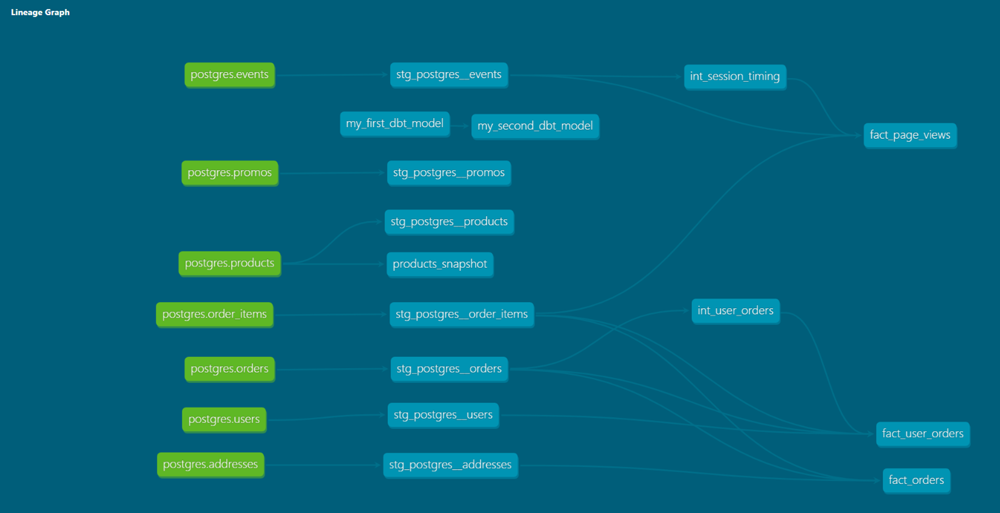

# Part 1:
## Question 1: What is our user repeat rate?

Answer: 0.798

```
with order_num as (
    select
        user_id
        ,count(order_id) as orders
    from dev_db.dbt_rodrigocarrionaudibenede.stg_postgres__orders
    group by user_id
),
buckets as (
        select
            count(distinct case when orders >=2 then user_id end) / count(distinct case when orders >=1 then user_id end) as repeat_rate
        from order_num
        )
select *
from buckets;
``` 

## Question 2: What are good indicators of a user who will likely purchase again? What about indicators of users who are likely NOT to purchase again? If you had more data, what features would you want to look into to answer this question?

Answer: 
    - Good indicators of users likely to purchase again: Predicatble recurrent purchases, constant or increasing purchase volumes over time, positive feedback after first 
    purchase.
      
    - Good indicators of users unlikely to purchase again: heavily delayed deliveries, negative feedback after purchase, product returns.

    If I had more data, I would look at purchase feedback, NPS, and other indicators of interaction satisfaction. 

## Question 3: Explain the product mart models you added. Why did you organize the models in the way you did?

I added product, marketing, and core (orders) models to my mart models. I organized them independently of staging and intermeidate to keep proper hierarchy. Also, there are intermediate models for marketing and orders because there were useful CTEs that could be reusable down the line. 

## Question 4: Use the dbt docs to visualize your model DAGs to ensure the model layers make sense


# Part 2:

## Question 1: What assumptions are you making about each model? (i.e. why are you adding each test?) Did you find any “bad” data as you added and ran tests on your models? How did you go about either cleaning the data in the dbt model or adjusting your assumptions/tests?

Assumptions: All primary keys are unique and not null. Event types have a limited amount of accepted values. The user_id secondary key in the events table has a reltionship with the primary key at the users table. I did not encounter bad data, so I did not need to do any cleanup or adjusting. 

## Question 2: Your stakeholders at Greenery want to understand the state of the data each day. Explain how you would ensure these tests are passing regularly and how you would alert stakeholders about bad data getting through

There is a test called freshness that can be used for tracking update delays. I would set it up and automate an email sendout so stakeholders know when not to use a dataset.
```
freshness:
      warn_after: {count: 24, period: hour}
      error_after: {count: 48, period: hour}
```

# Part 3: 

## Question 1: Which products had their inventory change from week 1 to week 2? 

Pothos
Philodendron
Monstera
String of pearls