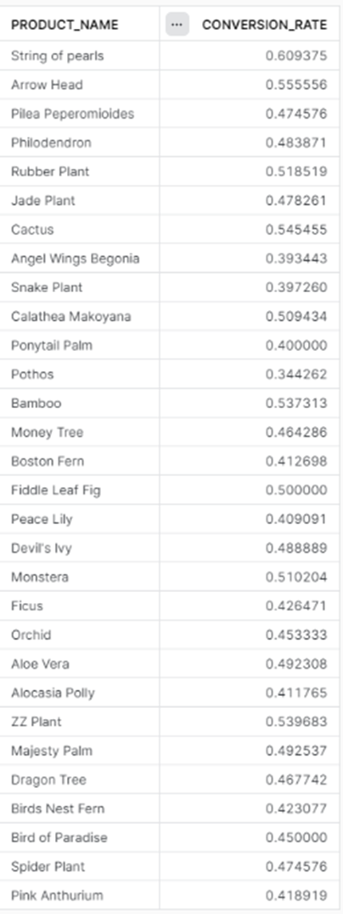
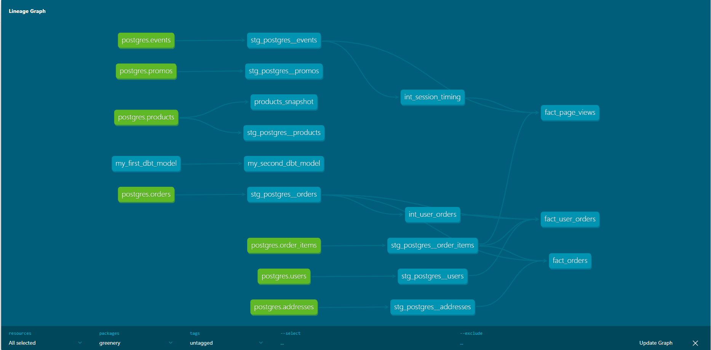

# PROJECT 3 - Rodrigo Carrion

## Question 1

### Conversion Rate

Answer: 62.467%
```
select 
    count (distinct case when checkout > 0 then session_id end) / count (distinct session_id) as conversion_rate
from dev_db.dbt_rodrigocarrionaudibenede.fact_page_views
```

### Conversion Rate by Product
Answer:


```
select
    pv.product_id,
    product_name,
    count(distinct case when checkout > 0 then session_id end) / count (distinct session_id) as conversion_rate
from dev_db.dbt_rodrigocarrionaudibenede.fact_page_views as pv
left join dev_db.dbt_rodrigocarrionaudibenede.stg_postgres__products as p on p.product_id = pv.product_id
group by pv.product_id, product_name
```

## Question 2:
I created the "sum_of" macro, which allowed me to simplify my case statements so as to not write repetitive code, by instead passing the case values as a variable for the statement to use.

## Question 3:
I created the grant.sql macro, and then the posthook+ to directly grant reporting rights to the entire greenery folder. 

## Question 4:
I created the packages.yml file and installed dbt utils and dbt expectations. Then, I used get_colum_values to simplify further the case statement that I had improved with macros in question 2. I also used the dbt utils test "accepted range" to test whether a field had values outside the 0 to 100 range.

## Question 5:


## Question 6:
The products that changed are: Philodendron, String of pearls, Monstera, Pothos.